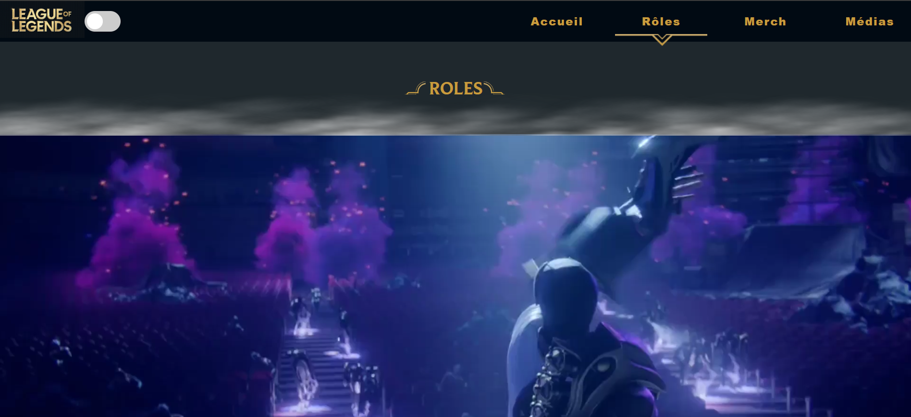

# Roles page

This page was developed by [me](https://github.com/saintgregoire) during a group project with my classmates.
You can get acquainted with the roles of the characters and the most popular characters in the game "League of Legends" in our opinion.

**==> View all [screenshots](./RolesScreen.md) of this page**

## Summary

- [Philosophy](#philosophy)
- [License](#license)
- [Tools](#tools)
- [Installation](#installation)

## Philosophy

I tried to adhere to two main principles:

* [KISS](https://en.wikipedia.org/wiki/KISS_principle)
* [Unix philosophy](https://en.wikipedia.org/wiki/Unix_philosophy)

I wanted to preserve as much as possible the design and color scheme of the official game website, but at the same time adding my own ideas.

## License

Was created under the [MIT License](./LICENSE)

*Some materials were taken from the [official website of the game](https://www.leagueoflegends.com/fr-fr/).*

## Tools

Frontend 

* **JavaScript** :  
manipulation of DOM and JS events;  
opening and closing modal windows;  
adding a ready-made script to create a smoke effect.
* **СSS** :  
setting styles and animations;
 responsive design for different devices.

* **HTML** : 
 creating a Project Structure.

## Installation

To work with the project you will need **Git**
* [How to install Git.](https://git-scm.com/book/en/v2/Getting-Started-Installing-Git)

### Local installation:

On the command line, navigate to the folder where the project will be deployed. Then copy it from GitHub:

`$ git clone https://github.com/saintgregoire/LoL`
